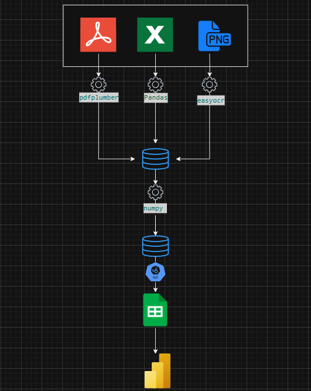

# Recibos de Despesas de Hotel  - Compilação e Análise de Custos de Colaboradores em Hotel

**Autor:** Maria Vitória de Oliveira Mello 

## Descrição do Projeto

**Recibo de Despesas de Hotel** Foi desenvolvido utilizando o framework Streamlit. O projeto foi desenhado para facilitar e agilizar o processo de análise e registro de despesas de colaboradores de uma empresa em Hoteis.

O sistema permite que os colaboradores enviem arquivos em diversos formatos, direcionando cada um automaticamente para o fluxo de processamento adequado, conforme sua extensão.

## Funcionalidades Principais

A aplicação segue o seguinte fluxo.

-   **Usuário introduz os arquivos:** O usuário insere o arquivo através da interface.
-   **Processamento de Dados:** Os dados são processados e compilados.
-   **Identificação da Flag Alcooólica:** Identifica através de um dicionário de palavras se o item é alcoólico ou não.
-   **Exibição em Tela:** Os dados são exibidos em tela permitindo a validação.
-   **Envio ao Sheets:** Caso haja click no botão, os dados compilados são enviados ao Sheets.

## Tecnologias Utilizadas
* **Linguagem:** Python (Streamlit 1.49.1)
* **Base de Dados:** Sheets

